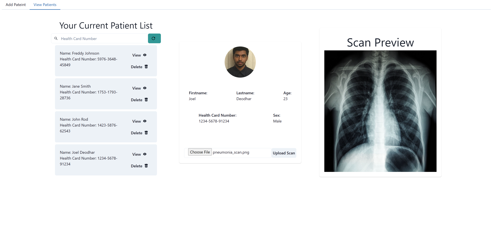

# Pneumonia Detection
Pneumonia is a common illness affecting millions of people around the world. Detecting whether a patient has pneumonia can be a time-consuming process from the time X-Ray images have been taken to when a qualified doctor can analyze them. This repository aims to provide an automated approach of this using deep learning. The input data are scans of X-Ray images of peoples chest, and  the model will determine whether the patient has Pneumonia or not. Alongside the core Machine Learning component, there is also a full fledge application built using ReactJS that allows the secure creation of accounts for Doctors that can run scans and manage multiple patients. 


<p float="left" width="100%">
   
  
</p>


# Installation of Application

The entire application is standalone and containerized via docker. To launch the application run the following command

```commandline
docker compose up
```

Runtime environment parameters are stored in a [.env](./.env) file, a runnable version exists in the repository but it is recommended to change the usernames and passwords to something more secure before running the application


# Installation of Machine Learning Component

To run training create a new virtual environment with your package manager of choice

### Using Pip
```commandline
pip install -r requirements.txt
```

Alternatively you can run the following if you would like to use pipenv
```commandline
pipenv  install -r requirements.txt
```


### Alternatively, using Pipenv:

#### For Pytorch with only CPU support
```commandline
pipenv install -v --categories "packages pytorch_cpu"
```

#### For pytorch with only CPU+GPU (Cuda 11.8) support

```commandline
pipenv install -v --categories "packages pytorch_cuda"
```

To activate the virtual environment run
```commandline
pipenv shell
```


# Dataset
The dataset being used in this repository is from the [RSNA Pneumonia Detection Challenge](https://www.kaggle.com/competitions/rsna-pneumonia-detection-challenge/data?select=stage_2_train_images). This dataset contains ~30 000 images in total, since the test ground truth is not publicly available there is a utility script to split the original train dataset into a train split and test split.
```commandline
python process_dataset.py --data_dir "Path/To/Raw/Dataset/" --output_dir "Output/Dir/RNSADataset"
```

# Train

To train the model run the following command, additional arguments can be passed to further modify the training configuration, the following is a sample command that can be run to train the model. Typically, the default parameters will suffice for training the model. 
```commandline
python train.py --data "Path/To/Formatted/Dataset/" --output_dir "Output/Dir/RNSADataset" --epochs 100 --val_freq 10
```

The following is the confusion matrix after training the model


# Inference

To run inference on a given image once the model has been trained run the following command, the script will print the result to console.
```commandline
python predict.py --data "Path/To/Image.png" --device "cuda" --load_model "Path/To/Model.pth"
```

# Tensorboard Bug
If on Windows and tensorboard is rendering as a white page, follow the instructions present [here](https://github.com/tensorflow/tensorboard/issues/3117#issuecomment-605531669), this is a bug with tensorflow, this should work correctly on UNIX systems.
